# 🗺️ Holiday Package Purchase Prediction

## 📂 About Dataset

"Trips & Travel.Com" company wants to enable and establish a viable business model to expand the customer base. One of the ways to expand the customer base is to introduce a new offering of packages

Currently, there are 5 types of packages the company is offering 
- Basic 
- Standard
- Deluxe
- Super Deluxe
- King

Looking at the data of the last year, we observed that 18% of the customers purchased the packages. However, the marketing cost was quite high because customers were contacted at random without looking at the available information. 
The company is now planning to launch a new product i.e. Wellness Tourism Package. 
Wellness Tourism is defined as Travel that allows the traveler to maintain, enhance or kick-start a healthy lifestyle, and support or increase one's sense of well-being.
However, this time, company wants to harness the available data of existing and potential customers to make the marketing expenditure more efficient.

## 📄 Content

The dataset includes information on customer demographics, travel preferences, and purchase history over the past year. It helps in identifying the profile of customers most likely to purchase the newly introduced Wellness Tourism Package. Make it easy for others to get started by describing how you acquired the data and what time period it represents, too.

- Most important features that impact the product being taken: Designation, Passport, Tier City, Marital Status, Occupation.
- Customers with the designation "Executive" should be the target audience for the company.
- Customers who have a passport, are from a Tier 3 city, are single/unmarried, and have a large business have a higher likelihood of purchasing the new package.
- Customers with a monthly income in the range of ₹15,000–₹25,000 and age between 15–30, who prefer 5-star properties, also have a higher chance of purchasing the new package based on EDA.

## 💡 Inspiration

We need to analyze the customers' data and information to provide recommendations to the Policy Maker and Marketing Team and also build a model to predict the potential customer who is going to purchase the newly introduced travel package.

---

### 🎯 Objective:
Predict whether a customer will purchase a holiday package based on their demographic and behavioral data.

### 🧠 Skills & Tools Used:
- 🐍 Python, 🧮 Pandas, 📊 NumPy  
- 🛠️ Scikit-learn (EDA, Feature Engineering, Modeling)  
- 🌲 Gradient Boosting Classifier  
- 🎛️ Hyperparameter Tuning (RandomizedSearchCV)  
- 📉 Matplotlib & 📈 Seaborn (Visualizations)  
- 🌐 Streamlit (Interactive UI)  
- 💾 Joblib (Model Deployment)

### 📊 Key Features:
- 📈 EDA Dashboard (Heatmaps, Class Distribution)
- 📊 Model Comparison & ROC Curves (8+ models)
- 🧠 Feature Importance Insights
- 🔮 Real-time Prediction Interface
- 📥 Download Logs, Models, and Preprocessor

### 📈 Performance:
- ✅ Accuracy: 96.5%  
- 🏆 F1 Score: 0.90  
- 🚀 ROC AUC: 0.91

---

## Visualizations

### Product Taken Vs Product Not Taken Pie Chart
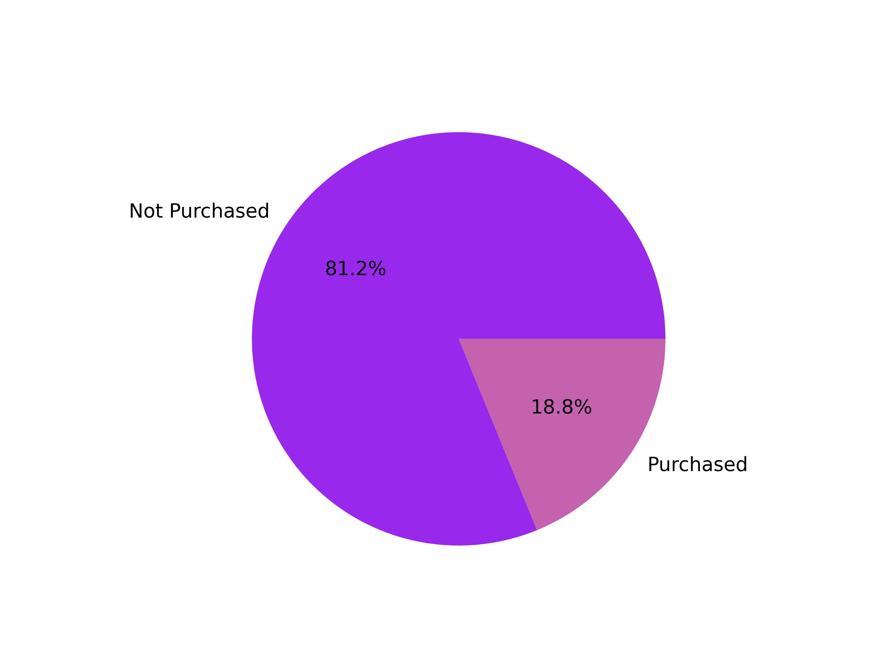

### Models Comparison
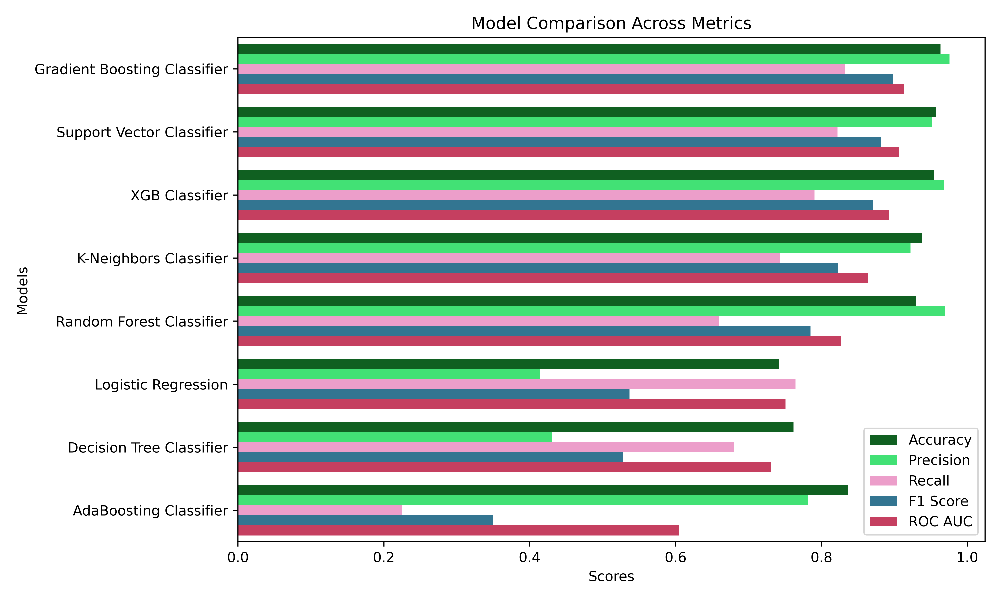

--- 

## ROC AUC Curves

### Logistic Regression ROC Curve
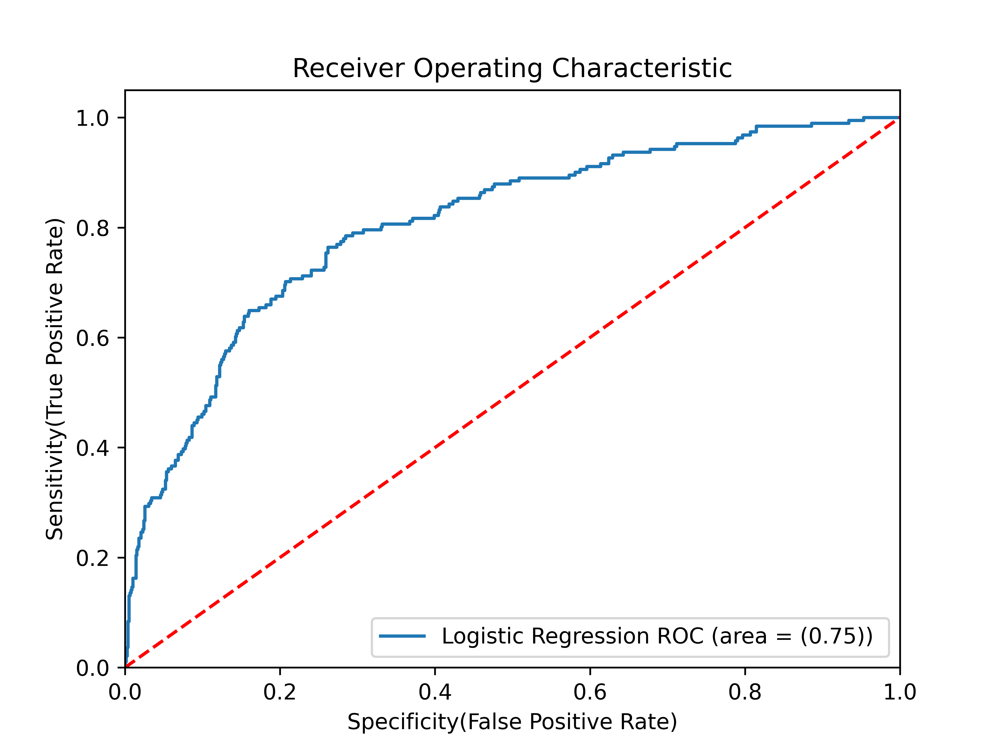

### Support Vector Classifier ROC Curve
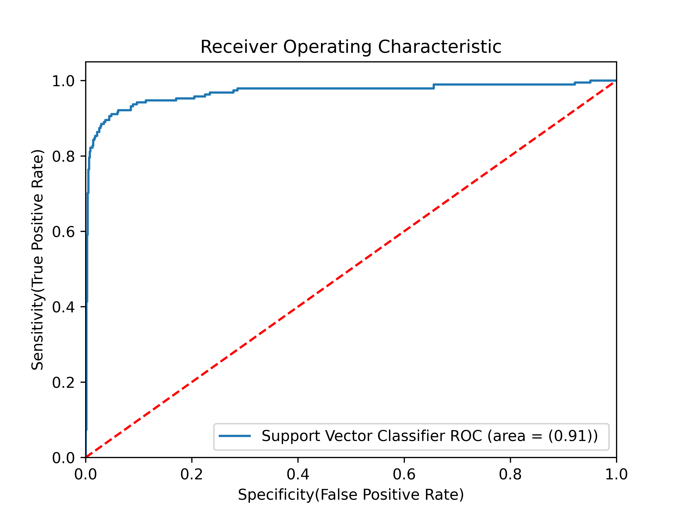

### Gaussian Naive Bayes ROC Curve
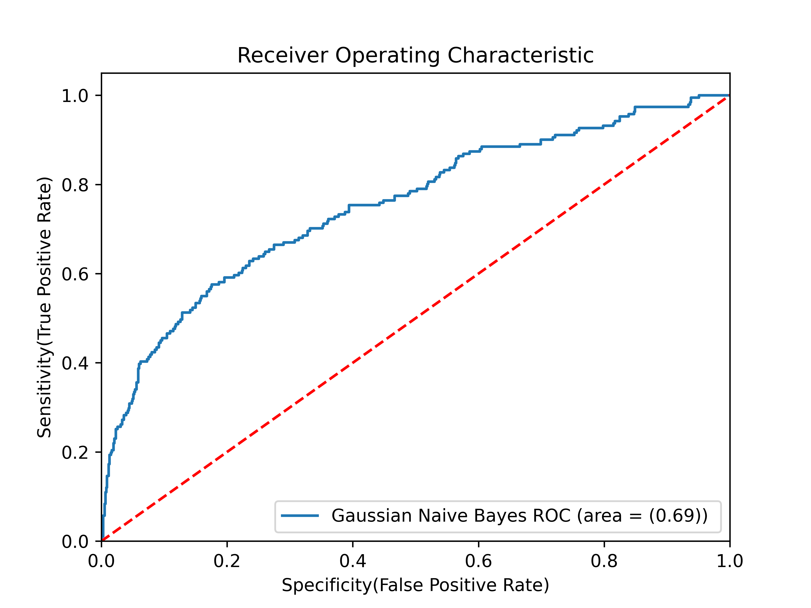

### K-Neighbors Classifier ROC Curve
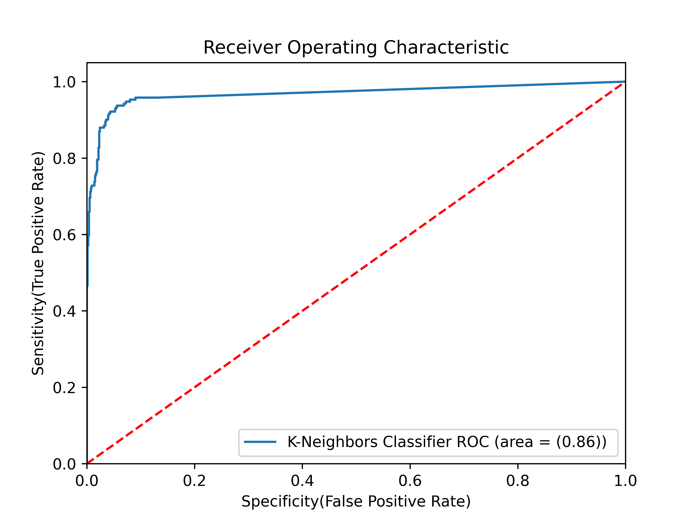

### Decision Tree Classifier ROC Curve
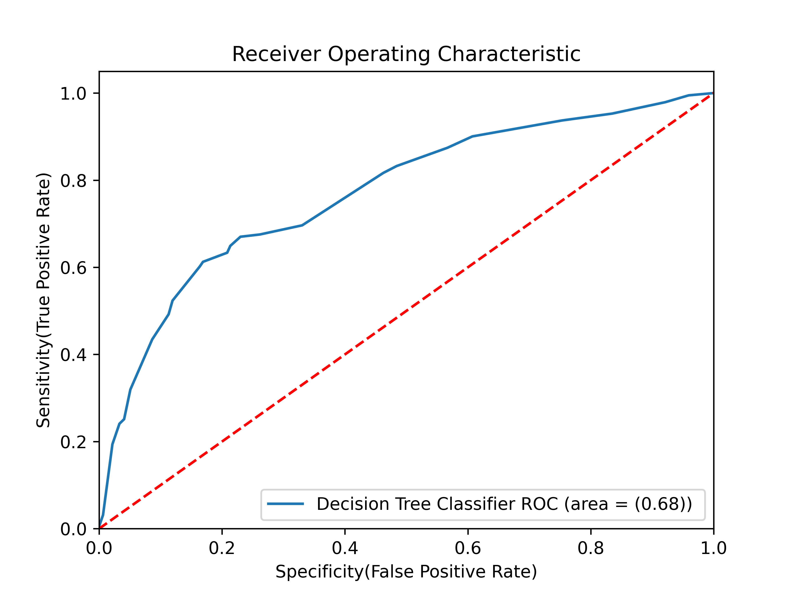

### Random Forest Classifier ROC Curve
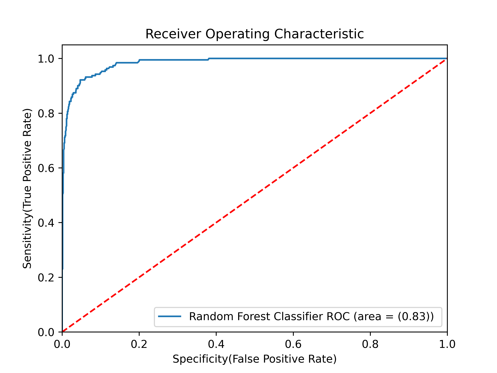

### AdaBoost Classifier ROC Curve
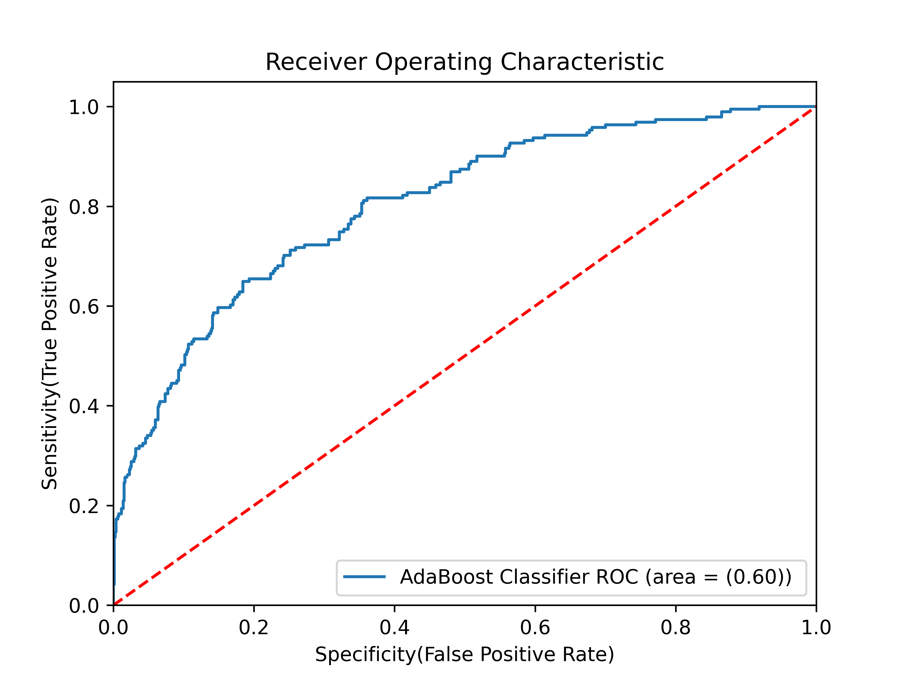

### Gradient Boosting Classifier ROC Curve
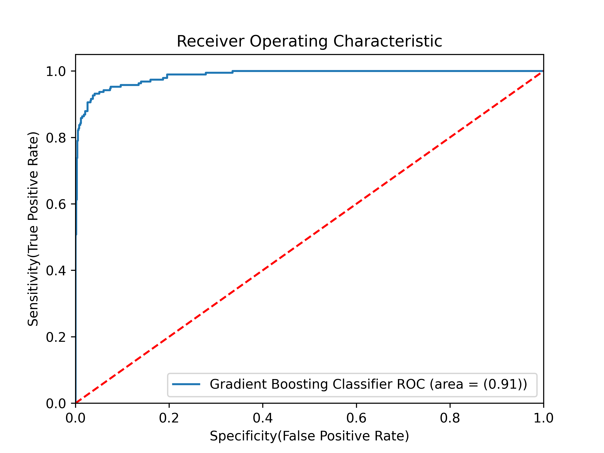

### eXtreme Gradient Boosting Classifier ROC Curve
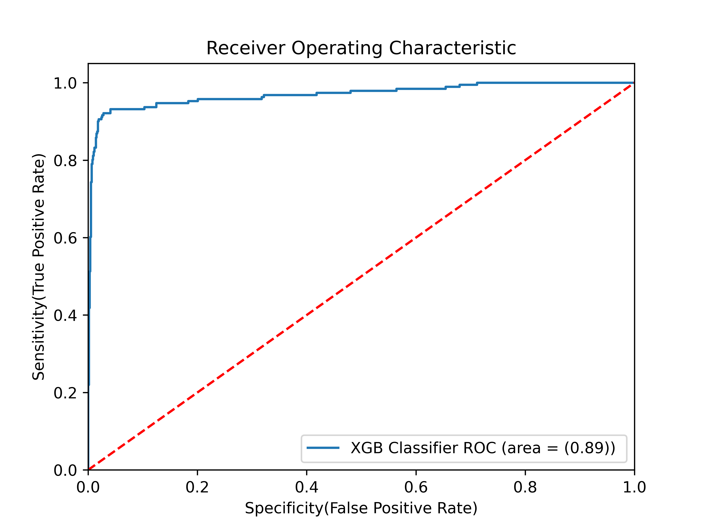

--- 

## Streamlit

🔗 Live Demo
👉 [Click here to open the Streamlit App](https://holiday-package-purchase-prediction-using-classification.streamlit.app/)

---
